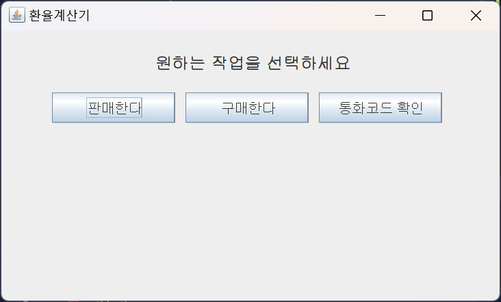
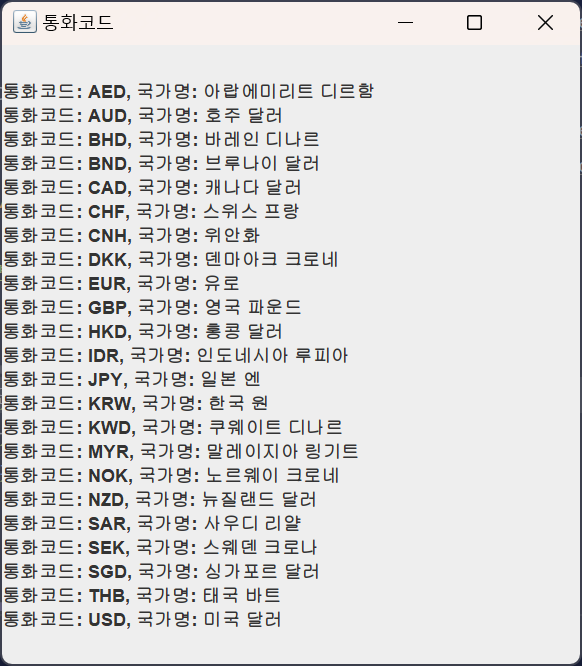
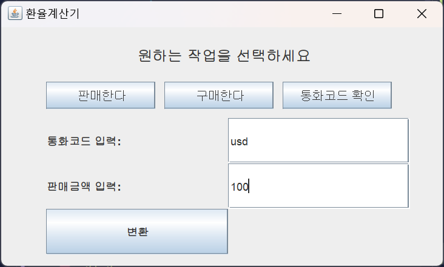
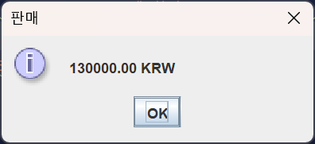
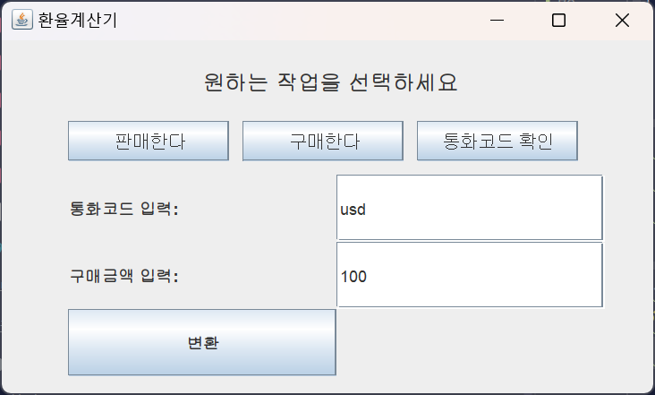
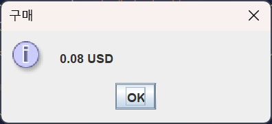

# Exchange rate calculator 

------------
- 이 프로그램은 **한국수출입은행의 open API**를 활용한 환율 계산기 입니다.
<div>

</div>
<div style="text-align: center">
    <a href="https://hits.seeyoufarm.com"></a>
</div>


<h1>Exchange rate calculator using JFrame and the Export-Import Bank of Korea open API v1.0</h1>

---------
> **KIC Campus**  
> **개발기간 : 1.8 ~ 1.26**

# 개발자 

---
|                 **이상준**                  |
|:----------------------------------------:|
|                       |
| [@namung08](https://github.com/namung08) |
|            안산대학교 컴퓨터 정보학과 졸업             |

# 프로젝트 소개 

---
- **일일 환율 조회** : 한국수출입은행의 open API 를 사용하여 일일 환율 데이터를 가지고 환율을 계산해 주는 프로그램 입니다.
- **환율 변환** : 23개국의 환율을 가져와 KRW 를 시작하여 구매와 다른 나라의 돈을 우리나라 돈으로 얼마를 구매 할 수 있는지 확인할 수 있습니다.
- **간편한 사용자 인터페이스** : JFrame을 사용하여 직관적이고 사용하기 쉬운 인터페이스를 제공합니다.

# 시작 가이드 

---
- **프로그래밍 언어** : [Java 17](https://www.oracle.com/java/technologies/javase/jdk17-archive-downloads.html)
- **라이브러리** : Simple-Json (JSON 처리)
- **API** : 한국 수출입은행 Open API
- **빌드 도구** : Gradle
- **사용 툴** : [IntelliJ IDEA](https://www.jetbrains.com/ko-kr/idea/)

```bash
git clone https://github.com/namung08/autoExchanged.git
cd autoExchanged
```

# 기술 스텍 📚

---
<div align=center> 
<h3>Environment</h3>
    
<h3>Config</h3>

<h3>Development</h3>


<h3>Communication </h3>


</div>

# 화면 구성 

---
| **메인**                  | **통화코드 확인 화면**          |
|-------------------------|-------------------------|
|  |  |

| **외화 판매 화면**              | **판매 결과 화면**            |
|---------------------------|-------------------------|
|  |  |

| **외화 구매 화면**              |**구매 결과 화면**|
|---------------------------|---|
|  ||

# 주요 기능 

---
## ⭐️ 통화 코드 확인 기능
- 통화코드 확인 버튼을 눌러 23개국의 통화코드
- 코드 별 나라 이름을 확인 가능하다
## ⭐️ 외화 판매 기능
- 판매할 통화 코드와 외화의 판매 금액을 작성하면 KRW 로 변환
- 수수료는 계산 하지 않음
## ⭐️ 외화 구매 기능
- 구매할 통화 코드와 외화의 구매 금액을 작성하면 해당 나라의 돈으로 변환
- 수수료는 계산 하지 않음

# 아키텍쳐 

--- 
```perforce
autoExchanged/
├── .gitignore
├── build.gradle
├── gradlew
├── gradlew.bat
├── README.md
├── settings.gradle
└── src/
└── main/
└── java/
└── com/
└── exchanger/
├── fram/
│   ├── CurrencyFram.java
│   ├── CurrencyFrambuy.java
│   ├── CurrencyFrameCheck.java
│   └── CurrencyFramSell.java
├── run/
│   └── Main.java
└── utils/
├── CheckCurrencyCode.java
├── CurrencyCodeMap.java
├── Exchange.java
└── ExchangeRateUtils.java
```